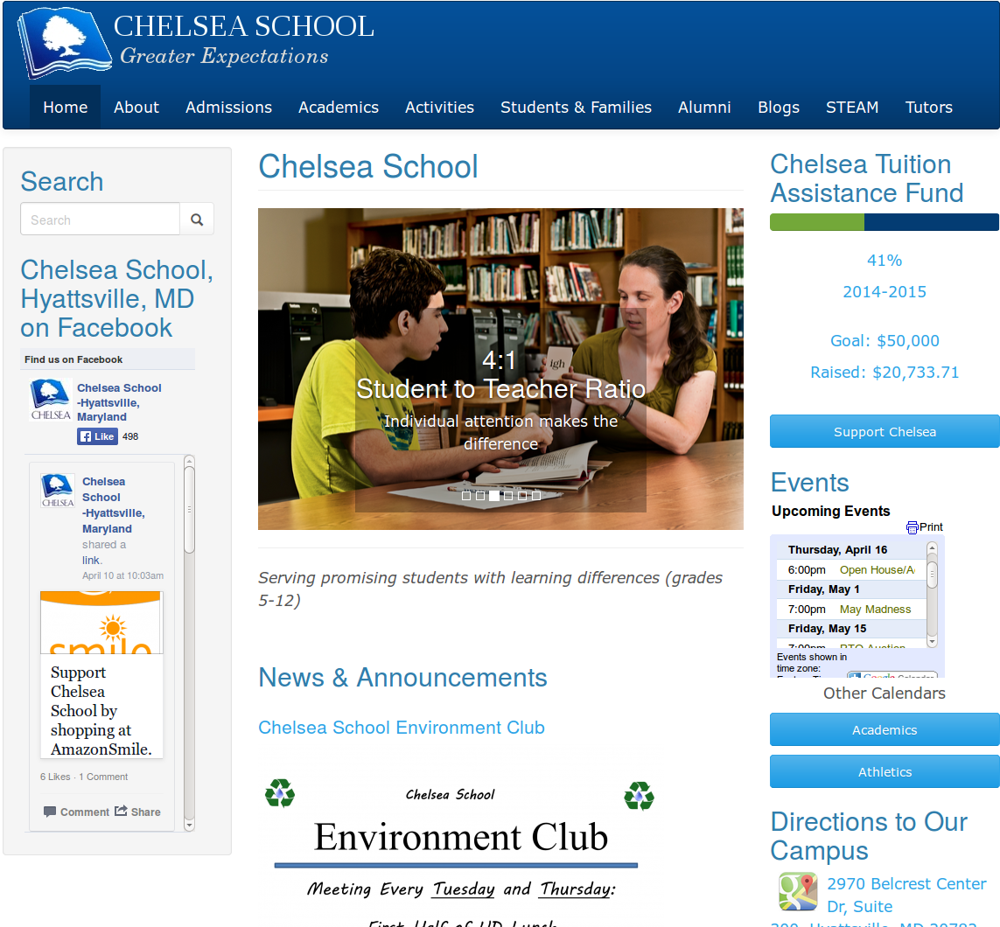
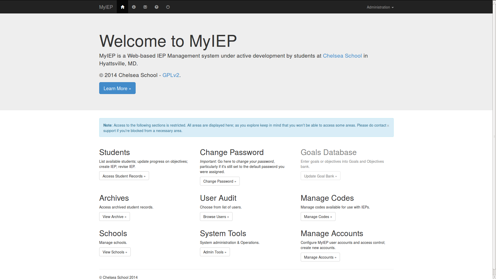

===============================================
Computing Courses at Chelsea: a Retrospective
===============================================

Chelsea School Homepage Refit
========================================================

Students informed the 2014 refit of Chelsea School's home page and learned to create sites with the Drupal content management system.

They were also critical usability and accessibility testers.

Visit `Chelsea School <http://chelseaschool.edu>`_ at http://chelseaschool.edu.

Next Generation Presentations
=================================================================

In 2015, students created cinematic presentations using the `Impress.js <https://bartaz.github.io/impress.js/>`_ JavaScript library.

See our scrapbook `here <_static/scrapbook/index.html>`_ for an example of our work.

In-House IEP Management Software
===========================================================

2013-2014, students developed our in-house, web-based IEP-management software, which they dubbed "`MyIEP <http://localhost/MyIEP>`_."

Appliances
===============

Appliances, in this context, are lean servers optimized to accomplish a single function with outstanding efficiency and strong security.

This program began with computing students creating appliances for distribution/publication for `Turnkey GNU/Linux <http://turnkeylinux.org>`_.

Over the course of a couple of semesters, Turnkey GNU/Linux picked up several appliances for distribution that were produced by students on the development team. A few are described below.

Sahana Eden
------------

`Sahana Eden <http://www.turnkeylinux.org/sahana-eden>`_ is an Emergency Development Environment platform for rapid deployment of humanitarian response management.

Its rich feature set can be rapidly customized to adapt to existing processes and integrate with existing systems to provide effective solutions for critical humanitarian needs management either prior to or during a crisis.

In other words...Eden built so that first responders can reprogram the software to suit the unique, critical needs of a humanitarian crisis as soon as their boots touch the soil.

Elgg
-----

`Elgg <http://www.turnkeylinux.org/elgg>`_ is an award-winning social networking engine, delivering the building blocks that enable businesses, schools, universities and associations to create their own fully-featured social networks and applications. It offers blogging, microblogging, file sharing, networking, groups and a number of other features.

Elgg is ideal for education institutions.

LimeSurvey
-----------

`LimeSurvey <http://www.turnkeylinux.org/limesurvey>`_ is a user-friendly web application that enables users to develop and publish surveys, and collect responses, without doing any coding. Users can use rich text in questions and messages, using a rich text editor, and images and videos can be integrated into surveys.

Web2Py
-------

`web2py <http://turnkeylinux.org/web2py>`_ is a free open source framework for rapid development of fast, scalable, secure and portable database-driven web-based applications. Written and programmable in Python. It includes a web-based IDE that helps you create, modify, deploy and manage application from anywhere using your browser.
